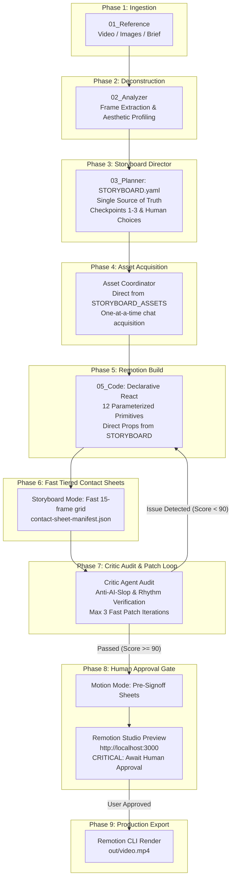

# REMOTION MOTION GRAPHICS HARNESS & AI ORCHESTRATION PIPELINE

Welcome to the **Remotion Motion Graphics Pipeline**. This document serves as the canonical operational specification and architecture manual for orchestrating high-end, rhythmically phrased, authored motion graphics videos using AI agents and Remotion.

---

## 🏛️ 1. Pipeline Architecture Overview

The system operates as a **Hybrid Autonomous Pipeline with Hard Quality Gates**. Autonomous agents deconstruct visual references, compose temporal rhythm structures, generate assets, construct React Remotion scenes, compile AI-optimized contact sheets, and execute critic audit patch loops. The pipeline strictly halts at **Phase 8** for human director inspection before triggering production video rendering.



---

## 👥 2. Agent Roles & Responsibilities

| Role | Primary Responsibility | Key Outputs |
| :--- | :--- | :--- |
| **Motion Director** (Orchestrator) | Guides overall project lifecycle, coordinates subagents, enforces invariants, and prompts the Human Director. | `PIPELINE.md`, master execution flow |
| **Analyzer Agent** | Extracts video frames, dissects color palettes, motion easing curves, transition cuts, and typographical styling on *external reference videos*. | `refined_analysis.yaml`, extracted frame stills |
| **Script Writer** | Conceives narrative structure, messaging, and dialogue (*What is being said*). | `SCRIPT.md` |
| **Storyboard Director** | Commercial film director deciding visual shots, camera blocking, reveals, metaphors, and pacing strictly adhering to [creative_rulebook.md](file:///c:/Users/PC/myapps/Remotion/creative_rulebook.md) (*How audience experiences it*). | `STORYBOARD.yaml`, `STORYBOARD_NOTES.md`, `RULEBOOK_AUDIT.yaml`, `STORYBOARD_ASSET_REQUIREMENTS.yaml` |
| **Asset Coordinator** | Identifies external source media directly from storyboard requirements and acquires dependencies one-by-one with automated validation (*What is needed*). | `ASSET_MANIFEST.yaml` |
| **Builder Agent** | Implements declarative Remotion TSX code utilizing the 12 Parameterized Motion Primitives driven by `STORYBOARD.yaml` (*Technical code*). | `Composition.tsx`, `scenes/SceneXX.tsx` |
| **Critic Agent** | Sole post-render multimodal auditor verifying rhythm contrast, composition hierarchy, AI-slop avoidance ([AGENTS.md](file:///c:/Users/PC/myapps/Remotion/AGENTS.md)), and CTA payoff. | `critique.json`, `critique.md`, contact sheet inspection |
| **Human Director** | Makes major creative decisions at Storyboard checkpoints and grants final rendering permission. | Creative Choices & Render Sign-Off |

---

## 📁 3. Canonical Project Filesystem Structure (Lean, Zero-Waste)

Every video project lives inside `projects/<project-slug>/`:

```
projects/<project-slug>/
├── 01_Reference/
│   ├── video/                      # Reference MP4/WebM videos
│   └── images/                     # Static moodboards, reference stills, UI screenshots
│
├── 02_Analyzer/
│   ├── frames/                     # Extracted reference frames (Analyzer)
│   ├── refined_analysis.yaml       # Deconstructed timing, aesthetic, and transition profile
│   ├── contact_sheets_storyboard/  # Fast structural audit sheets (Critic)
│   │   ├── contact_001.jpg
│   │   └── contact-sheet-manifest.json
│   ├── contact_sheets_motion/      # Dense sequential motion sheets (Pre-signoff)
│   │   ├── contact_001.jpg
│   │   └── contact-sheet-manifest.json
│   ├── critique.md                 # Human-readable audit report with ✓, △, ✗ marks
│   └── critique.json               # Machine-readable audit report for AI patch loop
│
├── 03_Planner/
│   ├── core_aesthetic.yaml         # Color tokens, typography, shadows, spring configs
│   ├── STORYBOARD.yaml             # SINGLE SOURCE OF TRUTH (Scenes, shots, timing, text)
│   ├── STORYBOARD_NOTES.md         # Human-readable creative direction & rationale
│   ├── STORYBOARD_ASSET_REQUIREMENTS.yaml # Direct dependency list for Asset Coordinator
│   ├── STORYBOARD_DECISIONS.yaml   # Immutable human creative decision history
│   ├── SCRIPT_FEEDBACK.yaml        # Optional script feedback notes
│   └── storyboard/                 # Versioned storyboard archives (v001, v002...)
│
├── 04_Assets/
│   └── ASSET_MANIFEST.yaml         # Asset metadata, validation logs & stable ID registry
│
└── 05_Code/                        # Remotion React component implementation
    ├── Composition.tsx             # Master sequence reading directly from STORYBOARD.yaml
    └── scenes/
        ├── Scene01.tsx             # Modular scene implementations
        ├── Scene02.tsx
        └── Scene03.tsx
```

> [!NOTE]
> Physical media files are stored directly in `public/projects/<project-slug>/` for instant Remotion `staticFile()` resolution, completely eliminating the duplicate filesystem copy/sync step.

---

## 🔄 4. Stage-by-Stage Operational Protocol

### Phase 1: Reference Ingestion (`01_Reference`)
- **Input**: Local video (`01_Reference/video/*.mp4`), reference images (`01_Reference/images/*`), or a creative text brief.
- **Action**: Place files into the project folder or initialize via:
  ```powershell
  & "C:\Users\PC\.bun\bin\bun.exe" run pipeline:init <project-slug>
  ```

### Phase 2: Frame Deconstruction & Aesthetic Profiling (`02_Analyzer`)
- **Action**: Extract reference frames and deconstruct the visual language:
  ```powershell
  & "C:\Users\PC\.bun\bin\bun.exe" scripts/extract-frames.ts <project-slug> [video-file]
  ```
- **Analysis Deliverable (`02_Analyzer/refined_analysis.yaml`)**:
  - Color palette (dominant, surface, accent, text)
  - Typography weights and hierarchy
  - Camera movements (pans, tracking, zoom velocity)
  - Motion dynamics (spring damping, stiffness, mass)
  - Transition mechanics (match cuts, wipes, fades)

### Phase 3: Storyboard Director Layer (`03_Planner`)
The **Storyboard Director Agent** acts as an experienced commercial film director / storyboard artist / editor. It collaborates with the Script Writer and Human Director to decide **HOW THE SCRIPT BECOMES A VIDEO**.

```
SCRIPT WRITER ──► SCRIPT.md
                      ↓
         [ STORYBOARD DIRECTOR ]
                      ↓
  CHECKPOINT 1: Story Direction (STORYBOARD_NOTES.md)
                      ↓ (Human Review / Choice)
  CHECKPOINT 2: Shot-by-Shot Plan (STORYBOARD.yaml) ──► SCRIPT_FEEDBACK.yaml (Optional notes)
                      ↓ (Human Approval)
  CHECKPOINT 3: Production Readiness (STORYBOARD_ASSET_REQUIREMENTS.yaml)
                      ↓
          Phase 4: Asset Acquisition Layer
```

#### 1. Core Responsibilities & Division of Labor
- **Script Writer**: Decides *what is being said* (`SCRIPT.md`).
- **Storyboard Director**: Decides *how the audience experiences it* (shots, framing, camera motion, reveals, pacing).
- **Human Director**: Decides *which creative direction to pursue* via mandatory checkpoints.
- **Asset Coordinator**: Acquires *what media is needed* (one-by-one).
- **Remotion Builder**: Implements *technical code* from locked storyboard.

#### 2. Three Mandatory Human Checkpoints
1. **Checkpoint 1 (Story Direction)**:
   - Proposes core visual idea, visual language, camera language, editing language, performance language, and ending strategy.
   - Surfaces major creative decisions (e.g. `D001`, `D002`) with viable alternatives for human choice.
   - Outputs: `03_Planner/STORYBOARD_NOTES.md`.
2. **Checkpoint 2 (Shot-by-Shot Storyboard & Perceptual Plan)**:
   - Compiles atomic shots strictly adhering to [creative_rulebook.md](file:///c:/Users/PC/myapps/Remotion/creative_rulebook.md) with stable IDs (`S01_SH01`, `S01_SH02`), timing, valid purpose, primary `attention_target`, `viewer_should_notice`, `viewer_should_understand`, `viewer_should_feel`, cognitive budget `attention_load` (`low` | `medium` | `high` | `extreme`), framing, camera movement, motion design, typography, audio relations, and rhythm events.
   - Enforces **rhythm_system.md** non-uniform temporal pacing (Templates A–G).
   - Validates Rulebook Invariants: Active hooks, cognitive load wave, comprehension holds, and inevitable payoff endings.
   - Preserves archives in `03_Planner/storyboard/storyboard_v001.yaml`.
   - Outputs: `03_Planner/STORYBOARD.yaml` and `03_Planner/RULEBOOK_AUDIT.yaml`.
3. **Checkpoint 3 (Production Readiness)**:
   - Maps required external assets into `03_Planner/STORYBOARD_ASSET_REQUIREMENTS.yaml` for consumption by Phase 4.

#### 3. Script Notes Feedback Loop (`SCRIPT_FEEDBACK.yaml`)
If the script contains lines with no visual interpretation, unrealistic density, or comedic payoffs that conflict with cut timing, the Storyboard Director emits a formal `SCRIPT_NOTE` rather than silently rewriting dialogue.

#### 4. Immutable Decisions Log (`STORYBOARD_DECISIONS.yaml`)
Records all human creative choices with timestamps and rationale. Future agents must respect approved decisions.

#### 5. CLI Commands
```powershell
# Checkpoint 1: Formulate and inspect Story Direction proposal
& "C:\Users\PC\.bun\bin\bun.exe" run storyboard:direction <project-slug>

# Checkpoint 2: Compile full shot-by-shot storyboard and archives
& "C:\Users\PC\.bun\bin\bun.exe" run storyboard:build <project-slug>

# Record a human creative choice
& "C:\Users\PC\.bun\bin\bun.exe" scripts/storyboard-director.ts decide <project-slug> <decision-id> "<choice>"

# View current storyboard status and shot summary
& "C:\Users\PC\.bun\bin\bun.exe" run storyboard:status <project-slug>
```

### Phase 4: Asset Acquisition Layer (`04_Assets`)
The agent acts as an **Asset Producer & Coordinator** (not the video builder). It translates reference analysis into an internal asset dependency graph, distinguishes procedural Remotion code from external source media, and acquires required assets from the user **ONE AT A TIME**.

```
REFERENCE VIDEO / ANALYSIS
            ↓
[ requirementsMapper.ts ] ──► Distinguishes ASSET vs REMOTION PROCEDURAL
            ↓
  ASSET_REQUIREMENTS.yaml ──► Internal Prioritized Dependency Graph
            ↓
┌──────────────────────────────────────────────────────────────┐
│             ONE-ASSET-AT-A-TIME ACQUISITION LOOP             │
│                                                              │
│  Identify next unresolved asset (by priority 1 to 6)         │
│                        ↓                                     │
│  Prompt user with reference context & requirements           │
│           ↙                        ↘                         │
│  OPTION A: PROVIDE           OPTION B: GENERATE              │
│  (User supplies path)        (Create GenerationSpec)         │
│           ↓                                ↓                 │
│  Validate format/alpha       Generate image/render           │
│           ↘                        ↙                         │
│       Approve & Register into ASSET_MANIFEST.yaml            │
│       Mirror to public/projects/<slug>/                      │
│       Bind stable ID into VIDEO_SPEC.yaml                    │
└──────────────────────────────┬───────────────────────────────┘
                               ↓
                   ASSET READINESS REPORT (Ready)
                               ↓
           Phase 5: Declarative Remotion Scene Construction
```

#### 1. Distinguish Source Media vs Remotion Procedural
Do **NOT** request assets that Remotion can reasonably create in code:
- **Remotion Procedural (No external file)**: Basic shapes, rectangles, simple gradients (`<GradientBackground />`), text (`<Headline />`, `<Caption />`, `<WordReveal />`), 3D particle systems (`<ParticleField />`), shadows, glass panels (`<GlassCard />`), buttons (`<CTA />`), lens noise/grain (`<Noise />`, `<FilmGrain />`).
- **Source Media (External asset required)**: Photographed products, real people/characters, bespoke brand logos/SVGs, custom photographic textures, video overlays, audio/voice stems, 3D glTF models.

#### 2. Strict One-Asset-At-A-Time Rule
The coordinator **NEVER** requests multiple assets in a single message.
Each asset is requested in priority order with reference context and requirements:
```text
Asset 01 of 3 — Hero Showcase Subject

Reference usage:
Visual showcase subject in 3D Particle Showcase from 00:02.50 to 00:04.30.
Role: Hero subject occupying 40% of frame, center stage.
Target Scenes: [scene_02, scene_03]

I need:
- transparent background (PNG or alpha mask)
- minimum resolution: 1200px
- clean isolated silhouette

Choose:
[Provide asset] -> Path to your local file
[Generate asset] -> Generate high-fidelity asset via generation spec
```

#### 3. Acquisition Options: Provide vs Generate & Autonomous File Routing
- **Conversational Inference**: The user interacts naturally in chat. The agent infers whether the user provides a path/upload or requests generation.
- **Option A (Provide)**: User supplies a file path or uploads media. The agent validates technical attributes, automatically moves/copies the file to `projects/<project-slug>/04_Assets/<scene>/<asset_id>.<ext>` and mirrors to `public/projects/<project-slug>/`, then registers it.
- **Option B (Generate)**: User requests generation. The agent derives a structured `GenerationSpec`, generates the image via `generate_image`, validates the output, moves/copies it to the designated paths, and registers it.
- **Seamless Progression**: The user never needs to manually move files. The agent routes files to their canonical locations and immediately advances to the next asset or to Phase 5 once all assets are resolved.

#### 4. Automated Technical Validation
Before accepting any asset, [assetValidator.ts](file:///c:/Users/PC/myapps/Remotion/src/assets/assetValidator.ts) inspects:
- Resolution against `minimumResolution`
- Alpha channel presence if `transparency: true`
- Aspect ratio deviations
- Supported formats (PNG, SVG, WebP, JPEG)

#### 5. Immutable Asset Identity & Registry
Every approved asset is recorded in `projects/<project-slug>/04_Assets/ASSET_MANIFEST.yaml` with stable ID (e.g. `asset_product_01`), mirrored to `public/projects/<project-slug>/`, and bound in `VIDEO_SPEC.yaml`.

#### 6. CLI Commands
```powershell
# Map requirements and separate procedural vs external media
& "C:\Users\PC\.bun\bin\bun.exe" run assets:map <project-slug>

# Surface next unresolved asset prompt for the user
& "C:\Users\PC\.bun\bin\bun.exe" run assets:next <project-slug>

# View asset readiness report
& "C:\Users\PC\.bun\bin\bun.exe" run assets:status <project-slug>

# Register user-provided asset
& "C:\Users\PC\.bun\bin\bun.exe" scripts/asset-coordinator.ts register <project-slug> <asset-id> --provided <path>

# Register AI-generated asset
& "C:\Users\PC\.bun\bin\bun.exe" scripts/asset-coordinator.ts register <project-slug> <asset-id> --generated <path>
```

### Phase 5: Declarative Remotion Scene Construction (`05_Code`)
- **Action**: Construct declarative TSX components using the **12 Parameterized Motion Primitives**:
  - Typography: `<Headline />`, `<Caption />`, `<WordReveal />`
  - Reveals: `<ImageReveal />`, `<MaskReveal />`
  - Camera & Texture: `<CameraShake />`, `<Zoom />`, `<Noise />`, `<FilmGrain />`
  - Atmosphere & Payoff: `<GradientBackground />`, `<LogoLockup />`, `<CTA />`
- Assemble master composition in `05_Code/Composition.tsx` using `TransitionSeries`.
- Register composition in `src/Root.tsx`.

### Phase 6: AI-Optimized Contact Sheet Generation (`02_Analyzer/contact_sheets_*`)
- **Action**: Generate high-contrast, machine-readable contact sheets and manifests:
  ```powershell
  # Storyboard mode (structural keypoints: entry, apex, settled, exit)
  & "C:\Users\PC\.bun\bin\bun.exe" run contact:sheets <project-slug> storyboard

  # Motion mode (dense sequential sampling across timeline)
  & "C:\Users\PC\.bun\bin\bun.exe" run contact:sheets <project-slug> motion
  ```
- **Vision Rules**:
  - Thumbnails maintain uncompromised 16:9 aspect ratio.
  - High-contrast 32px monospace metadata strip (`023 | 00:04.21 | scene_03 | shot_01`) placed **underneath** each thumbnail without overlaying image content.
  - Generates `contact-sheet-manifest.json` mapping frame numbers, timestamps, scene IDs, shot IDs, rows, and columns.

### Phase 7: Critic Agent Audit & Bounded Patch Loop (`02_Analyzer/critique.*`)
- **Action**: Run the Critic Agent audit:
  ```powershell
  & "C:\Users\PC\.bun\bin\bun.exe" run critic:audit <project-slug>
  ```
- **Quality Checks Evaluated**:
  1. **Hierarchy**: Presence of dominant headline, clear typographical scale.
  2. **Timing & Pacing**: Balanced entrance delays, transition duration $< 40\%$ of scene.
  3. **Rhythm**: Temporal contrast across scenes (rejects uniform shot lengths).
  4. **AI-Slop Avoidance**: Scans for prohibited clichés (glowing tech blobs, neural nodes, robot heads, fake circuit UI).
  5. **Payoff**: Presence of decisive closing visual payoff or CTA.
  6. **Visual Contact Sheet Coverage**: Cross-references `contact-sheet-manifest.json` ensuring all scenes have verified keyframes.
- **Bounded Autonomous Patch Loop**:
  - If score $< 90$ or high-severity issues exist: Builder Agent applies surgical patches to `SceneXX.tsx`, regenerates contact sheets, and re-audits.
  - Maximum **3 autonomous patch iterations**. If unresolved after 3 cycles, escalate `critique.md` to the user for manual guidance.

### Phase 8: Interactive Studio Review & Mandatory Approval Gate
- **Action**: Launch the interactive Remotion Studio for human review:
  ```powershell
  & "C:\Users\PC\.bun\bin\bun.exe" run dev
  ```
- Review the composition in browser at `http://localhost:3000`.
- **MANDATORY DIRECTIVE**: Never trigger production video rendering without explicit user approval in chat!

### Phase 9: Production Video Export
- **Action**: Upon receiving explicit user approval, render the final video:
  ```powershell
  & "C:\Users\PC\.bun\bin\bun.exe" run remotion render src/index.ts <CompositionId> out/<project-slug>.mp4
  ```

---

## ⚡ 5. Master Orchestrator CLI

The pipeline provides a single unified entry point to run or inspect any project:

```powershell
# 1. Initialize a new project directory with 5-stage scaffolding
& "C:\Users\PC\.bun\bin\bun.exe" run pipeline:init <project-slug>

# 2. Run the complete automated pipeline loop (Sync → Contact Sheets → Critic Audit)
& "C:\Users\PC\.bun\bin\bun.exe" run pipeline:run <project-slug>

# 3. Individual modular phase commands
& "C:\Users\PC\.bun\bin\bun.exe" run sync:assets <project-slug>
& "C:\Users\PC\.bun\bin\bun.exe" run contact:sheets <project-slug> storyboard
& "C:\Users\PC\.bun\bin\bun.exe" run contact:sheets <project-slug> motion
& "C:\Users\PC\.bun\bin\bun.exe" run critic:audit <project-slug>
& "C:\Users\PC\.bun\bin\bun.exe" run dev
```

---

## 🚫 6. Invariants & Directives Checklist

Before presenting any video project to the user, ensure all checks pass:

- [ ] **Anti-AI-Slop Directive ([AGENTS.md](file:///c:/Users/PC/myapps/Remotion/AGENTS.md))**:
  - No generic blue/purple/cyan glowing gradients or liquid auroras.
  - No floating 3D spheres, neural nodes, circuits, robot heads, or hologram tropes.
  - Typography is specific, contextual, and grounded (Inter, Outfit, bespoke monospace).
  - Design has a clear structural idea that functions even in monochrome.
- [ ] **Temporal Rhythm Invariant ([rhythm_system.md](file:///c:/Users/PC/myapps/Remotion/rhythm_system.md))**:
  - No equal shot lengths (e.g. `[2.0s, 2.0s, 2.0s]` is banned).
  - Uses an approved rhythm template (e.g. Template B: Burst $\to$ Hold $\to$ Burst $\to$ Payoff).
  - Cuts are motivated by visual events, not placed mechanically on every audio beat.
- [ ] **Contact Sheet Manifest Sync**:
  - `contact-sheet-manifest.json` matches visual grid coordinates (rows, cols, frames).
  - Metadata strip is rendered beneath thumbnail, not on top of frame pixels.
- [ ] **Motion Video & Ad Creative Rulebook Invariant ([creative_rulebook.md](file:///c:/Users/PC/myapps/Remotion/creative_rulebook.md))**:
  - `RULEBOOK_AUDIT.yaml` passes with score $\ge 90$ and 0 errors.
  - Exactly ONE primary attention target declared for every shot (`attention_target`).
  - Cognitive budget respected: no $\ge 3$ consecutive `EXTREME` attention loads.
  - Active hook utilized in opening shot (no static logo screen or generic greeting).
  - Holds and perceptual resets are present to guarantee viewer comprehension.
  - Decisive payoff resolution and inevitable ending designed into the final frame.
- [ ] **Approval Gate Invariant**:
  - Final video rendering (`out/*.mp4`) is NEVER executed without explicit user confirmation.

