# REMOTION MOTION GRAPHICS HARNESS & AI ORCHESTRATION PIPELINE

Welcome to the **Remotion Motion Graphics Pipeline**. This document serves as the canonical operational specification and architecture manual for orchestrating high-end, rhythmically phrased, authored motion graphics videos using AI agents and Remotion.

---

## 🏛️ 1. Pipeline Architecture Overview

The system operates as an **Audio-First, Scene-Deconstructed Motion Pipeline with Hard Human Gates**. Autonomous agents deconstruct reference videos per scene, establish temporal beat skeletons before scripting, collaborate with the user on creative intake and assets, compile declarative Remotion code, and audit quality via contact sheets and in-chat refinement loops.

```mermaid
flowchart TD
    subgraph P1["Phase 1: Reference Deconstruction"]
        P1A[1A: Temporal Deconstruction<br/>Watch video → Timestamped pacing,<br/>cuts, intention, hook, payoff]
        P1B[1B: Visual Deconstruction<br/>Scene snapshots → Animation, camera,<br/>transitions, SFX, palette, depth]
        P1C[1C: Audio Foundation<br/>Select/analyze soundtrack → BPM,<br/>beat grid, energy curve, cut windows]
        P1A --> P1B --> P1C
    end

    subgraph P2["Phase 2: Script & Creative Development"]
        SC[Structured User Intake<br/>Format, audience, emotion, CTA,<br/>duration, brand elements]
        SD[Script Draft<br/>Written on audio skeleton +<br/>deconstruction DNA]
        SC --> SD
    end

    subgraph P25["Phase 2.5: Script & Rhythm Audit"]
        SA[Rhythm Audit<br/>rhythm_system.md templates vs beat map<br/>Flag generic copy, pacing issues]
    end

    subgraph P3["Phase 3: Asset & Tech Planning"]
        AP[Per-Scene Asset Map<br/>Procedural vs external media]
        TP[Per-Scene Tech Stack<br/>Required Remotion primitives, 3D, shaders]
        AP --> TP
    end

    subgraph P35["Phase 3.5: Interactive Asset Co-Design"]
        AC[Scene-by-Scene Chat<br/>Palette co-design, reference/generate,<br/>user collaboration]
    end

    subgraph P37["Phase 3.7: Storyboard Lock"]
        SL[Final Storyboard<br/>Rebuilt with concrete assets,<br/>refined script, locked audio<br/>→ STORYBOARD.yaml]
        HA[Human Approval Gate]
        SL --> HA
    end

    subgraph P4["Phase 4: Remotion Build"]
        B[05_Code: Declarative React<br/>Parameterized Primitives<br/>Direct Props from STORYBOARD]
    end

    subgraph P5["Phase 5: Fast Contact Sheets"]
        CS[Storyboard Mode: 15-frame grid<br/>contact-sheet-manifest.json]
    end

    subgraph P6["Phase 6: Visual Refinement Loop"]
        RL[Draft MP4 & Keyframe Stills<br/>Agent In-Chat Visual Inspection<br/>Surgical Code Patches & Re-Render Loop]
    end

    subgraph P7["Phase 7: Critic Audit & Patch Loop"]
        CR[Critic Agent Audit<br/>Anti-AI-Slop & Rhythm Verification<br/>Max 3 Fast Patch Iterations]
    end

    subgraph P8["Phase 8: Human Studio Gate"]
        MS[Motion Mode: Pre-Signoff Sheets]
        ST[Remotion Studio Preview<br/>http://localhost:3000<br/>CRITICAL: Await Human Approval]
    end

    subgraph P9["Phase 9: Production Export"]
        EXP[Remotion CLI Render<br/>out/video.mp4]
    end

    P1C --> SC
    SD --> SA
    SA --> AP
    TP --> AC
    AC --> SL
    HA --> B
    B --> CS --> RL
    RL -- "Issues Found" --> B
    RL -- "Converged" --> CR
    CR -- "Score < 90" --> B
    CR -- "Score >= 90" --> MS --> ST
    ST -- "User Approved" --> EXP
```



---

## 👥 2. Agent Roles & Responsibilities

| Role | Primary Responsibility | Key Outputs |
| :--- | :--- | :--- |
| **Motion Director** (Orchestrator) | Guides overall project lifecycle, coordinates subagents, enforces invariants, and prompts the Human Director. | `PIPELINE.md`, master execution flow |
| **Multimodal Deconstruction Agent** | Watches reference video directly and inspects entry/apex/exit scene snapshots to extract motion mechanics, animation techniques, camera moves, transitions, and audio cues. | `TEMPORAL_ANALYSIS.yaml`, `VISUAL_ANALYSIS.yaml`, `DECONSTRUCTION.yaml` |
| **Audio Analyst** | Analyzes soundtrack or reference audio, extracts BPM/transients/energy, searches royalty-free music if needed, and builds temporal beat skeleton. | `00_Audio/analysis.yaml`, `00_Audio/temporal_skeleton.yaml` |
| **Script Writer** | Gathers user creative intake and writes timestamped, audio-locked dialogue, narration, and onscreen copy aligned with phrase boundaries. | `SCRIPT_INTAKE.yaml`, `SCRIPT.md` |
| **Script & Rhythm Auditor** | Audits draft script against `rhythm_system.md` templates and audio cut windows; detects generic AI copy and pacing violations. | `SCRIPT_AUDIT.yaml` |
| **Storyboard Director** | Commercial film director orchestrating atomic shots, visual metaphors, camera blocking, attention targets, and cognitive load strictly following [creative_rulebook.md](file:///c:/Users/PC/myapps/Remotion/creative_rulebook.md). | `STORYBOARD.yaml`, `STORYBOARD_NOTES.md`, `RULEBOOK_AUDIT.yaml` |
| **Asset Coordinator** | Collaborates with the user in chat on palette co-design, separates procedural Remotion code from external source media, and acquires assets one-by-one or in batch. | `STORYBOARD_ASSET_REQUIREMENTS.yaml`, `TECH_STACK_MAP.yaml`, `ASSET_MANIFEST.yaml` |
| **Builder Agent** | Implements declarative Remotion TSX code utilizing the Parameterized Motion Primitives driven by `STORYBOARD.yaml`. | `Composition.tsx`, `scenes/SceneXX.tsx` |
| **Refinement Agent** (In-Chat Vision) | Receives rendered draft MP4 & keyframe stills directly in chat, audits visual fidelity against `STORYBOARD.yaml` objectives, and applies iterative surgical patches. | `refinement_frames/`, `REFINEMENT_REPORT.yaml`, `REFINEMENT_STATE.yaml` |
| **Critic Agent** | Multimodal auditor verifying rhythm contrast, composition hierarchy, AI-slop avoidance ([AGENTS.md](file:///c:/Users/PC/myapps/Remotion/AGENTS.md)), and CTA payoff. | `critique.json`, `critique.md`, contact sheet inspection |
| **Human Director** | Provides creative intent, approves script and locked storyboard, and grants final rendering permission. | Intake Answers, Storyboard Lock & Render Sign-Off |

---

## 📁 3. Canonical Project Filesystem Structure (Lean, Zero-Waste)

Every video project lives inside `projects/<project-slug>/`:

```
projects/<project-slug>/
├── 00_Audio/                               # Foundational soundtrack & beat map (before scripting)
│   ├── soundtrack.wav                      # Selected/extracted audio track
│   ├── analysis.yaml                       # BPM, transients, spectral, energy profile
│   ├── beat_grid.yaml                      # Beat-level timing grid (4/4 time)
│   └── temporal_skeleton.yaml              # Cut windows, phrase boundaries, hold zones, energy curve
│
├── 01_Reference/
│   ├── video/                              # Reference MP4/WebM videos
│   └── images/                             # Moodboard images, reference stills, UI screenshots
│
├── 02_Deconstruction/                      # Multi-pass reference deconstruction & post-render audit
│   ├── frames/                             # Entry (~15%), apex (~50%), exit (~85%) scene snapshots
│   ├── scene_cuts.yaml                     # Scene boundary timestamps & frame manifest
│   ├── TEMPORAL_ANALYSIS.yaml              # Phase 1A: Timestamped pacing, cuts, intention analysis
│   ├── VISUAL_ANALYSIS.yaml                # Phase 1B: Per-scene animation, camera, transitions, SFX
│   ├── DECONSTRUCTION.yaml                 # Merged creative DNA feeding downstream phases
│   ├── contact_sheets_storyboard/          # Fast structural audit sheets (Critic)
│   ├── contact_sheets_motion/              # Dense sequential motion sheets (Pre-signoff)
│   ├── refinement_frames/                  # Draft render stills for in-chat visual loop
│   ├── REFINEMENT_STATE.yaml               # Refinement loop state tracking
│   ├── REFINEMENT_REPORT.yaml              # Refinement findings & patch history
│   ├── critique.md                         # Human-readable audit report
│   └── critique.json                       # Machine-readable audit report for AI patch loop
│
├── 03_Planner/
│   ├── SCRIPT_INTAKE.yaml                  # Phase 2: Structured user creative answers
│   ├── SCRIPT.md                           # Phase 2: User-approved, audio-locked script
│   ├── SCRIPT_AUDIT.yaml                   # Phase 2.5: Rhythm & copy audit results
│   ├── core_aesthetic.yaml                 # Generated FROM deconstruction (palette, typography, springs)
│   ├── TECH_STACK_MAP.yaml                 # Phase 3: Per-scene Remotion primitives, 3D, shaders
│   ├── STORYBOARD.yaml                     # Phase 3.7: SINGLE SOURCE OF TRUTH (LOCKED)
│   ├── STORYBOARD_NOTES.md                 # Human-readable creative direction & rationale
│   ├── STORYBOARD_ASSET_REQUIREMENTS.yaml  # Dependency list for Asset Coordinator
│   ├── STORYBOARD_DECISIONS.yaml           # Immutable human creative decision history
│   └── scenes/                             # Per-scene YAML specifications
│
├── 04_Assets/
│   └── ASSET_MANIFEST.yaml                 # Asset metadata, validation logs & stable ID registry
│
└── 05_Code/                                # Remotion React component implementation
    ├── Composition.tsx                     # Master sequence reading directly from STORYBOARD.yaml
    └── scenes/
        ├── Scene01.tsx                     # Modular scene implementations
        ├── Scene02.tsx
        └── Scene03.tsx
```

> [!NOTE]
> Physical media files are stored in `public/projects/<project-slug>/` for instant Remotion `staticFile()` resolution, completely eliminating duplicate filesystem copy/sync bottlenecks.

---

## 🔄 4. Stage-by-Stage Operational Protocol

### Phase 1: Reference Deconstruction

#### Phase 1A: Temporal Deconstruction (Multimodal Video Analysis)
- **Action**: The agent watches the reference video directly using multimodal understanding:
  1. Inspects the video file in `01_Reference/video/`.
  2. Identifies total duration, cut points, hook technique, average shot duration, and global rhythm template.
  3. Writes `02_Deconstruction/TEMPORAL_ANALYSIS.yaml`:
  ```yaml
  temporal_analysis:
    total_duration: 12.5s
    cut_count: 8
    avg_shot_duration: 1.56s
    hook_type: "visual_novelty"
    narrative_arc: "HOOK → ESTABLISH → ESCALATE → HOLD → PAYOFF"
    scenes:
      - id: scene_01
        timestamp: "00:00.00 - 00:01.80"
        duration: 1.8s
        intention: "Immediate visual hook — product in motion before context"
        pacing: "fast_entry"
        energy: 0.7
        cut_trigger: "percussion_hit"
  ```

#### Phase 1B: Visual Deconstruction (Scene Snapshots)
- **Action**: Extract entry, apex, and exit snapshots for each scene:
  ```powershell
  & "C:\Users\PC\.bun\bin\bun.exe" run deconstruct:frames <project-slug> scene_deconstruct
  ```
- The command extracts:
  - **Entry (`~15%`)**: Reveals how the scene introduces motion and elements.
  - **Apex (`~50%`)**: Captures peak visual composition, hierarchy, and lighting.
  - **Exit (`~85%`)**: Shows transition preparation and motion momentum.
- The agent inspects the extracted keyframes and writes `02_Deconstruction/VISUAL_ANALYSIS.yaml` covering:
  - **Animation techniques**: Easing, damping, kinetic entrance direction.
  - **Camera movements**: Pan, tilt, zoom velocity, orbital angle.
  - **Transitions**: Hard cuts, directional wipes, match cuts, mask reveals.
  - **Depth layers**: Background textures, midground cards, foreground focal objects.
  - **SFX & atmosphere**: Film grain, vignettes, chromatic aberration, procedural noise.
  - **Micro-motion**: Ambient particle drift, badge breathing, kinetic accent trails.
  - **Color & typography**: Dominant palette tokens, font weights, scale relationships.
- The agent merges temporal and visual findings into `02_Deconstruction/DECONSTRUCTION.yaml` — the foundational creative DNA.

#### Phase 1C: Audio Foundation (Soundtrack & Temporal Skeleton)
- **Action**: Establish the sonic foundation before writing the script:
  The agent prompts the user in chat:
  ```text
  🎵 AUDIO FOUNDATION

  Before we write the script, we need to establish the audio skeleton.
  The beat map will define where cuts can happen, where holds must exist,
  and what the energy curve looks like.

  Do you have a soundtrack / music track for this video?

  → If YES: provide the file path and I'll analyze it.
  → If NO: I'll analyze the reference video's audio to understand the mood,
    BPM, and energy — then search for royalty-free open-source music that
    closely matches and present you 2-3 options to choose from.
  ```
- **If user provides audio**: Place track into `00_Audio/soundtrack.wav`.
- **If user has no audio**:
  1. Extract audio from reference video:
     ```powershell
     & "C:\Users\PC\.bun\bin\bun.exe" run audio:extract <project-slug>
     ```
  2. Analyze reference audio BPM, key, and energy profile:
     ```powershell
     & "C:\Users\PC\.bun\bin\bun.exe" run audio:analyze <project-slug>
     ```
  3. Agent searches royalty-free repositories (Pixabay Music, Free Music Archive, Mixkit, Uppbeat Free) for adjacent tracks matching BPM, mood, and genre.
  4. Presents 2–3 options with preview links for the user to choose from.
- **Generate Temporal Skeleton**:
  ```powershell
  & "C:\Users\PC\.bun\bin\bun.exe" run audio:skeleton <project-slug>
  ```
  Produces `00_Audio/temporal_skeleton.yaml`:
  - `beat_grid`: 4/4 time grid with bar numbers, downbeats, and pulse markers.
  - `phrase_boundaries`: Musical section transitions.
  - `cut_windows`: Ranked cut opportunities (`strongest`, `strong`, `medium`, `weak`).
  - `hold_zones`: Energy dips where visual holds are required for viewer comprehension.
  - `energy_curve`: Macro progression curve (`LOW → MEDIUM → HIGH → HOLD → PAYOFF`).

---

### Phase 2: Script & Creative Development

The script is developed collaboratively in chat, locked to the audio skeleton and deconstruction DNA.

#### 1. Structured User Creative Intake
The agent presents the structured intake questionnaire in chat:
```text
📝 SCRIPT & IDEA DEVELOPMENT

I have the reference deconstruction and audio skeleton ready.
Before I write the script, I need your creative input:

1. What is this video for? (product launch / social ad / explainer / brand film / other)
2. Who is the audience?
3. What should they feel watching this?
4. What's the ONE action you want them to take after?
5. What's the single sentence they should remember?
6. Duration target? (reference: 12.5s, audio: 15.2s)
7. Mandatory brand elements? (logo, tagline, colors, tone-of-voice)
8. Anything the video must NOT include?
```
The agent saves answers to `03_Planner/SCRIPT_INTAKE.yaml`.

#### 2. Audio-Locked Script Drafting
The agent drafts `03_Planner/SCRIPT.md`:
- Each script line is timestamped against `temporal_skeleton.yaml` phrase boundaries.
- Major copy reveals occur at strong cut windows.
- Cognitive holds align with musical breakdown zones.

---

### Phase 2.5: Script & Rhythm Audit

Before visual storyboard planning begins, the agent audits `SCRIPT.md`:
1. **Rhythm Variation**: Verifies shot durations follow non-uniform templates (Templates A–G in `rhythm_system.md`). Equal shot lengths are strictly flagged.
2. **Audio Alignment**: Checks that scene cuts fall within valid cut windows ($\pm 100\text{ms}$ of beat/transient).
3. **Copy Quality**: Flags generic AI marketing clichés ("experience the future", "seamless solutions", "elevate your workflow").
4. **Cognitive Budget**: Ensures copy length fits comfortably within shot duration ($\le 2.5$ words per second).

Outputs `03_Planner/SCRIPT_AUDIT.yaml`. The agent presents flags in chat and refines the script with the user.

---

### Phase 3: Asset Planning & Tech Stack

#### 1. Asset Requirements Mapping
The agent reads `DECONSTRUCTION.yaml` and the approved `SCRIPT.md` to produce `03_Planner/STORYBOARD_ASSET_REQUIREMENTS.yaml`:
- **Remotion Procedural (No external file)**: Headlines, captions, word reveals, gradient backgrounds, noise/grain overlays, glass cards, buttons, basic particle fields.
- **Source Media (External asset required)**: Product renders, brand SVGs, hero photography, custom 3D models.

#### 2. Tech Stack Mapping
Outputs `03_Planner/TECH_STACK_MAP.yaml` declaring per-scene technical requirements:
- Required Remotion primitives (`<Headline />`, `<ImageReveal />`, `<Zoom />`, etc.).
- 3D requirements (Three.js / React Three Fiber).
- Custom shaders or canvas effects (glitch, blur, chromatic aberration).

---

### Phase 3.5: Interactive Asset Co-Design

The agent coordinates asset acquisition in chat:
1. **Palette Co-Design First**: Presents extracted palette from `DECONSTRUCTION.yaml`. User confirms, tweaks hex codes, or provides brand tokens.
2. **Hero Scene First**: Focuses on the hero visual element before secondary assets.
3. **One-at-a-Time Loop**: Presents each required asset with reference usage and format requirements:
   - User can provide local path/upload.
   - User can request AI generation (agent derives `GenerationSpec` and calls `generate_image`).
4. **Batch Escape**: If user says "generate all assets based on your judgment", agent handles the rest autonomously.
5. All assets are validated by `assetValidator.ts`, mirrored to `public/projects/<slug>/`, and registered into `04_Assets/ASSET_MANIFEST.yaml`.

---

### Phase 3.7: Storyboard Lock (Human Gate)

1. The agent rebuilds `03_Planner/STORYBOARD.yaml` with:
   - Concrete asset paths from `ASSET_MANIFEST.yaml`.
   - Confirmed color palette from `core_aesthetic.yaml`.
   - Audited script copy from `SCRIPT.md`.
   - Audio beat alignment from `temporal_skeleton.yaml`.
   - Motion vocabulary from `DECONSTRUCTION.yaml`.
2. Runs:
   ```powershell
   & "C:\Users\PC\.bun\bin\bun.exe" run storyboard:build <project-slug>
   ```
3. **MANDATORY HUMAN APPROVAL GATE**: The agent presents the locked storyboard summary to the user in chat. **No React code is written until the user approves the storyboard!**

---

### Phase 4: Declarative Remotion Scene Construction (`05_Code`)

- **Action**: Construct declarative TSX components using the **12 Parameterized Motion Primitives**:
  - Typography: `<Headline />`, `<Caption />`, `<WordReveal />`
  - Reveals: `<ImageReveal />`, `<MaskReveal />`
  - Camera & Texture: `<CameraShake />`, `<Zoom />`, `<Noise />`, `<FilmGrain />`
  - Atmosphere & Payoff: `<GradientBackground />`, `<LogoLockup />`, `<CTA />`
- Assemble master composition in `05_Code/Composition.tsx` using `TransitionSeries`.
- Register composition in `src/Root.tsx`.

---

### Phase 5: AI-Optimized Contact Sheet Generation (`02_Deconstruction/contact_sheets_*`)

- **Action**: Generate high-contrast, machine-readable contact sheets and manifests:
  ```powershell
  # Storyboard mode (structural keypoints: entry, apex, settled, exit)
  & "C:\Users\PC\.bun\bin\bun.exe" run contact:sheets <project-slug> storyboard

  # Motion mode (dense sequential sampling across timeline)
  & "C:\Users\PC\.bun\bin\bun.exe" run contact:sheets <project-slug> motion
  ```
- **Vision Rules**:
  - Thumbnails maintain 16:9 aspect ratio.
  - High-contrast 32px monospace metadata strip (`023 | 00:04.21 | scene_03 | shot_01`) placed **underneath** each thumbnail without overlaying image content.

---

### Phase 6: Visual Refinement Loop (Agent-in-the-Loop Feedback)

The **Refinement Agent** operates directly in chat to audit rendered draft output against storyboard intent and resolve visual discrepancies through bounded iteration.

```
05_Code (Remotion TSX) ──► bun run refine:render <slug>
                                  ↓
                     [ Draft MP4 + Strategic Keyframes ]
                     (entry, apex, settled, exit per scene)
                                  ↓
                     ┌────────────────────────────────────┐
                     │     IN-CHAT MULTIMODAL AUDIT       │
                     │  Agent inspects frames (view_file) │
                     │  Verifies:                         │
                     │  • Text legibility & overlap       │
                     │  • Palette matches core_aesthetic  │
                     │  • Spring settling at apex         │
                     │  • Attention target prominence     │
                     └─────────────────┬──────────────────┘
                                       ↓
                        Are Visual Objectives Met?
                                   ↙        ↘
                          NO (Issues)      YES (Converged)
                                 ↙            ↘
       Apply surgical patches to SceneXX.tsx   bun run refine:report --verdict=converged
                                 ↓                     ↓
               Re-render (Max 5 iterations)     Phase 7: Critic Audit
```

#### Strategic Keyframe Extraction
- **Entry (`~15%`)**: Initial reveal, entrance velocity, lack of visual stutter.
- **Apex (`50%`)**: Maximum visual impact, text legibility, proper focal hierarchy.
- **Settled (`~85%`)**: Settled typography, breathing room, lack of layout crowding.
- **Exit / Transition (`end - 2f`)**: Transition continuity and exit mask cleanliness.

#### CLI Commands
```powershell
# 1. Render draft MP4 & extract strategic keyframe stills
& "C:\Users\PC\.bun\bin\bun.exe" run refine:render <project-slug>

# 2. Log refinement verdict and archive iteration report
& "C:\Users\PC\.bun\bin\bun.exe" run refine:report <project-slug> --verdict=converged --score=95 --notes="All objectives verified"

# 3. Check refinement state and issue history
& "C:\Users\PC\.bun\bin\bun.exe" run refine:status <project-slug>

# 4. Reset refinement state back to iteration 0
& "C:\Users\PC\.bun\bin\bun.exe" run refine:reset <project-slug>
```

---

### Phase 7: Critic Agent Audit & Bounded Patch Loop (`02_Deconstruction/critique.*`)

- **Action**: Run the Critic Agent audit:
  ```powershell
  & "C:\Users\PC\.bun\bin\bun.exe" run critic:audit <project-slug>
  ```
- **Quality Checks Evaluated**:
  1. **Hierarchy**: Dominant headline, clear typographical scale.
  2. **Timing & Pacing**: Balanced entrance delays, transition duration $< 40\%$ of scene.
  3. **Rhythm**: Temporal contrast across scenes (rejects uniform shot lengths).
  4. **AI-Slop Avoidance**: Scans for prohibited clichés (glowing tech blobs, neural nodes, robot heads, fake circuit UI).
  5. **Payoff**: Decisive closing visual payoff or CTA.
  6. **Visual Contact Sheet Coverage**: Cross-references `contact-sheet-manifest.json`.
- **Bounded Autonomous Patch Loop**:
  - If score $< 90$: Builder Agent applies surgical patches, regenerates contact sheets, and re-audits.
  - Maximum **3 autonomous patch iterations**. If unresolved, escalate to user with `critique.md`.

---

### Phase 8: Interactive Studio Review & Mandatory Approval Gate

- **Action**: Launch interactive Remotion Studio for human review:
  ```powershell
  & "C:\Users\PC\.bun\bin\bun.exe" run dev
  ```
- Open `http://localhost:3000` to preview video timeline.
- **MANDATORY DIRECTIVE**: Never trigger production video rendering without explicit user approval in chat!

---

### Phase 9: Production Video Export

- **Action**: Upon receiving explicit user approval, render final video:
  ```powershell
  & "C:\Users\PC\.bun\bin\bun.exe" run remotion render src/index.ts <CompositionId> out/<project-slug>.mp4
  ```

---

## 📊 5. Universal Phase & Progress Tracking System

Every project in the harness automatically maintains an active phase registry and weighted progress tracker:
- **Manifest**: `projects/<project-slug>/PHASE_TRACKER.yaml`
- **Markdown Report**: `projects/<project-slug>/PROGRESS.md`

### 14-Phase Registry & Weighting Table:

| Phase | Phase Name | Category | Weight | Artifacts & Verifications |
| :--- | :--- | :---: | :---: | :--- |
| **Ph 1A** | Temporal Deconstruction | Foundation | 5% | `02_Deconstruction/TEMPORAL_ANALYSIS.yaml` |
| **Ph 1B** | Visual Deconstruction | Foundation | 5% | `02_Deconstruction/DECONSTRUCTION.yaml` |
| **Ph 1C** | Audio Foundation & Beat Skeleton | Foundation | 10% | `00_Audio/temporal_skeleton.yaml`, `soundtrack.wav` |
| **Ph 2.0** | Creative Intake & Script | Creative | 10% | `03_Planner/SCRIPT_INTAKE.yaml`, `SCRIPT.md` |
| **Ph 2.5** | Script & Rhythm Audit | Creative | 5% | `03_Planner/SCRIPT_AUDIT.yaml` |
| **Ph 3.0** | Asset & Tech Stack Planning | Planning | 5% | `03_Planner/STORYBOARD_ASSET_REQUIREMENTS.yaml` |
| **Ph 3.5** | Interactive Asset Co-Design | Planning | 5% | `04_Assets/ASSET_MANIFEST.yaml` |
| **Ph 3.7** | **Storyboard Lock `[HUMAN GATE 1]`** | Planning | 10% | Explicit user sign-off in `03_Planner/STORYBOARD.yaml` |
| **Ph 4.0** | Declarative Remotion Code Build | Production | 15% | `05_Code/Composition.tsx` & scene components |
| **Ph 5.0** | AI Vision Contact Sheets | Verification | 5% | Storyboard & motion contact sheets (batch extracted) |
| **Ph 6.0** | Visual Refinement Loop | Verification | 10% | `02_Deconstruction/REFINEMENT_STATE.yaml` (`converged`) |
| **Ph 7.0** | Critic Agent Vision Audit | Verification | 5% | `02_Deconstruction/critique.json` (Score $\ge 90$) |
| **Ph 8.0** | **Studio Preview & Approval `[HUMAN GATE 2]`** | Delivery | 5% | Studio inspection at `http://localhost:3000` & user approval |
| **Ph 9.0** | Production Video Export | Delivery | 5% | Master video exported to `out/<project-slug>.mp4` |

---

## ⚡ 6. Master Orchestrator CLI

```powershell
# 1. Initialize a new project with audio-first scaffolding & phase tracker
& "C:\Users\PC\.bun\bin\bun.exe" run pipeline:init <project-slug>

# 2. Universal Progress & Phase Tracking
& "C:\Users\PC\.bun\bin\bun.exe" run progress <project-slug>
& "C:\Users\PC\.bun\bin\bun.exe" run phase:status <project-slug>
& "C:\Users\PC\.bun\bin\bun.exe" run phase:sync <project-slug>
& "C:\Users\PC\.bun\bin\bun.exe" run phase:approve <project-slug> <phaseNumber>

# 3. Reference deconstruction
& "C:\Users\PC\.bun\bin\bun.exe" run deconstruct:frames <project-slug> scene_deconstruct

# 4. Audio pipeline (Extract → Analyze → Skeleton → Map → Compose → Master → Verify)
& "C:\Users\PC\.bun\bin\bun.exe" run audio:extract <project-slug>
& "C:\Users\PC\.bun\bin\bun.exe" run audio:analyze <project-slug>
& "C:\Users\PC\.bun\bin\bun.exe" run audio:skeleton <project-slug>
& "C:\Users\PC\.bun\bin\bun.exe" run audio:pipeline <project-slug>

# 5. Storyboard director & human approval
& "C:\Users\PC\.bun\bin\bun.exe" run storyboard:direction <project-slug>
& "C:\Users\PC\.bun\bin\bun.exe" run storyboard:build <project-slug>
& "C:\Users\PC\.bun\bin\bun.exe" run storyboard:status <project-slug>
& "C:\Users\PC\.bun\bin\bun.exe" run storyboard:direction approve <project-slug>

# 6. Asset coordination
& "C:\Users\PC\.bun\bin\bun.exe" run assets:map <project-slug>
& "C:\Users\PC\.bun\bin\bun.exe" run assets:next <project-slug>
& "C:\Users\PC\.bun\bin\bun.exe" run assets:status <project-slug>

# 7. High-Speed Contact sheets & visual refinement (25x–30x Speedup)
& "C:\Users\PC\.bun\bin\bun.exe" run contact:sheets <project-slug> storyboard
& "C:\Users\PC\.bun\bin\bun.exe" run contact:sheets <project-slug> motion
& "C:\Users\PC\.bun\bin\bun.exe" run refine:render <project-slug> --fast-still-only
& "C:\Users\PC\.bun\bin\bun.exe" run refine:status <project-slug>
& "C:\Users\PC\.bun\bin\bun.exe" run refine:report <project-slug> --verdict=converged --score=98

# 8. Automated quality audit & studio preview
& "C:\Users\PC\.bun\bin\bun.exe" run critic:audit <project-slug>
& "C:\Users\PC\.bun\bin\bun.exe" run pipeline:run <project-slug>
& "C:\Users\PC\.bun\bin\bun.exe" run dev
```

---

## 🚫 7. Invariants & Directives Checklist

Before presenting any video project to the user, ensure all checks pass:

- [ ] **Universal Phase & Progress Tracker**:
  - `PHASE_TRACKER.yaml` and `PROGRESS.md` exist and are synchronized via `bun run phase:sync`.
  - Active phase and completion percentage are verified before proceeding.
- [ ] **Dual Human Approval Gates**:
  - **Phase 3.7**: Code build is NEVER started before explicit storyboard approval in chat (`STORYBOARD.yaml`).
  - **Phase 8.0**: Final production video rendering (`out/*.mp4`) is NEVER executed without explicit user confirmation at `http://localhost:3000`.
- [ ] **High-Speed Batch Extraction Invariant (25×–30× Speedup)**:
  - Frame extraction MUST use single-pass sequence rendering (`remotion render --sequence --frames=...`).
  - `--props='{"disableAudio":true}'` MUST be passed during frame capture to bypass `ffprobe` audio probing.
  - Intermediate directories must not contain leading dots (`temp_frames`) and paths must be normalized to forward slashes.
- [ ] **Anti-AI-Slop Directive ([AGENTS.md](file:///c:/Users/PC/myapps/Remotion/AGENTS.md))**:
  - No generic blue/purple/cyan glowing gradients or liquid auroras.
  - No floating 3D spheres, neural nodes, circuits, robot heads, or hologram tropes.
  - Typography is specific, contextual, and grounded.
  - Design has a clear structural idea that functions even in monochrome.
- [ ] **Audio-First Skeleton**:
  - Soundtrack and beat grid established before script drafting.
  - Scene cuts aligned with audio cut windows and phrase boundaries.
  - Hold zones respected to give the viewer cognitive breathing room.
- [ ] **Temporal Rhythm Invariant ([rhythm_system.md](file:///c:/Users/PC/myapps/Remotion/rhythm_system.md))**:
  - No equal shot lengths (e.g. `[2.0s, 2.0s, 2.0s]` is banned).
  - Uses an approved rhythm template (e.g. Template B: Burst $\to$ Hold $\to$ Burst $\to$ Payoff).
- [ ] **Motion Video & Ad Creative Rulebook Invariant ([creative_rulebook.md](file:///c:/Users/PC/myapps/Remotion/creative_rulebook.md))**:
  - `RULEBOOK_AUDIT.yaml` passes with score $\ge 90$ and 0 errors.
  - Exactly ONE primary attention target declared for every shot (`attention_target`).
  - Cognitive budget respected: no $\ge 3$ consecutive `EXTREME` attention loads.
  - Active hook utilized in opening shot (no static logo screen or generic greeting).
  - Decisive payoff resolution and inevitable ending designed into the final frame.
